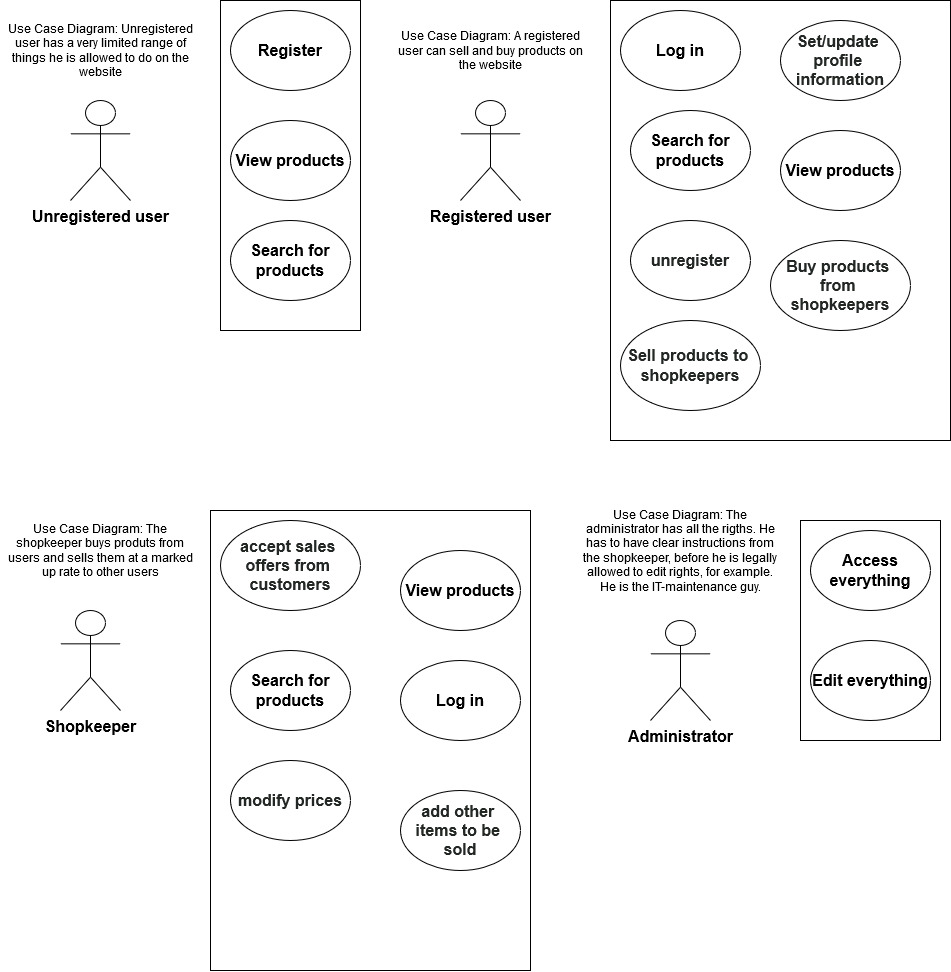
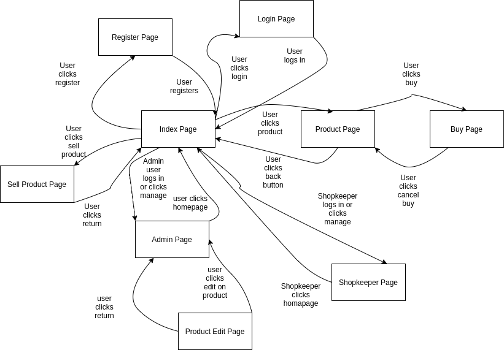

***Welcome to the home of your group's TIETA12, part 2 coursework code and documentation!***

This README.md file is where your group writes your project plan/project report.

When you write it, you must use Markdown. [Documentation for GitLab Flavored Markdown (GFM)](https://docs.gitlab.com/ee/user/markdown.html).

The directory structure of the code is up to your group to decide, but this README.md file must remain in place.

# Initial project plan document
The headers that must be present in this document are shown here. 

For instructions on what to add under these headers, see the course project assignment document, [see the coursework assignment document](https://docs.google.com/document/d/1ctG6mURrs1WlqwwPnMOFE_mSIEhZVCjp2XGefAZMdxQ/edit#heading=h.vsanic5plbto)

## Course project group information   
#### Group information: 
- Pietari Pakarinen; 431505; pietari.pakarinen@tuni.fi
- Lassi Palojärvi; 432220; lassi.palojarvi@tuni.fi
#### Group name: veeveevee-ryhmä
#### [GitLab repo URL](https://course-gitlab.tuni.fi/tieta12-2019-2020/veeveevee-ryhma)

## Planned functionality    

#### Timetable:
- coursework initial project plan by 02.03
- Assign issues for every group member 24.2
- Divide responsibilities 24.2

#### Common:
- [x] Make a project skeleton
- [x] Make a use case diagram to clarify user roles
- [ ] Make the coursework initial project plan by 02.03
- [ ] Write the first issues into the GitLab issue Board
- [ ] Assign issues for every group member
    - division of responsibility areas among group members

#### Frontend:
- [ ] Simple UI with react for testing functionality
    - Design Mockup UIs for each page and component
    - Design components
        - Divide each page into components
- [ ] Handle state with redux
    - Design state management between components
- [ ] Frontpage, index
    - Design Mockup UI for the frontpage
    - Design state management between frontpage components
- [ ] Product page
    - Design Mockup UI for the Product page
    - Design state management between frontpage Product page
- [ ] Buy page
    - Design Mockup UI for the Buy page
    - Design state management between frontpage Buy page
- [ ] Sell page
    - Design Mockup UI for the Sell page
    - Design state management between frontpage Sell page
- [ ] Manage page
    - Design Mockup UI for the Manage page
    - Design state management between frontpage Manage page
- [ ] Search component
    - Design Mockup search component
    - Design state management for the search component
- [ ] Log in UI
    - Design Mockup Log in component

#### Backend:
- [ ] Routes
- [ ] Models
- [ ] View
- [ ] Controllers
- [ ] User control
- [ ] Authentication with passport
- [ ] Testing, write unit tests

#### Use case diagram showcasing what different roles can do:

## Pages and navigation    

## Modules your group created in your Node project
- Project uses mvc as its project architecture
- Project will use stripe to handle payments

#### Modules:
- Router
- User controller
- Client controller
- Product controller
- Database

## Mongo database and Mongoose schemas    

#### Name of the model
DB 
Handles database connection
Methods:
- Connect
- Disconnect
- Error

#### Schemas

Product schema is connected to user via Original user attribute. The original user is who sold the product to the shopkeeper.
Image shcema is connected to product schema, as the images the product schema displays are stored as images.

The Role of the user schema in the system is to determine what the user is allowed to do on the website.
- User
    - Username, String
    - Password, String
    - Id, Number
    - Role, String
    - Email, String

The role of the product schema is to give a standard for the products on the website.
- Product
    - Category, String
    - Name, String
    - Offer price, Number
    - Sale price, Number
    - Keywords, [String]
    - Images, [String]
    - Id, Number
    - Original User, String

The role of the image schema is to allow us to store images into our database.
- Image
    - data, Buffer
    - type, String

## API
Client will be served from http://localhost:3000/ root directory.
Api routes will be served from http://localhost:3000/api/ 

- These routes are:
    - /user
    - /product

## React and Redux
React app is going to use Redux for state management
We will use React router to handle history

- Pages:
    - /
    - /manage
    - /login
    - /register
    - /product/:id
    - /buy
    - /sell

## Testing

Testing will done with Mocha and chai libraries on backend side.
Testing on react app will be done with Jest library

## Project timetable and division of work    

*Good luck and happy WWWdevvin’!*
